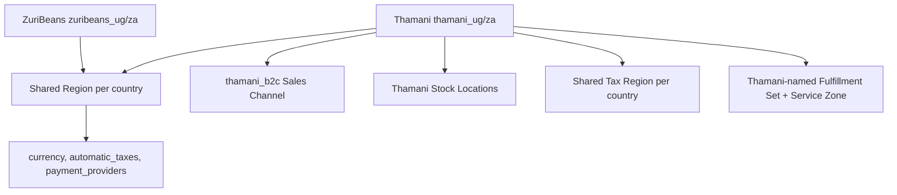
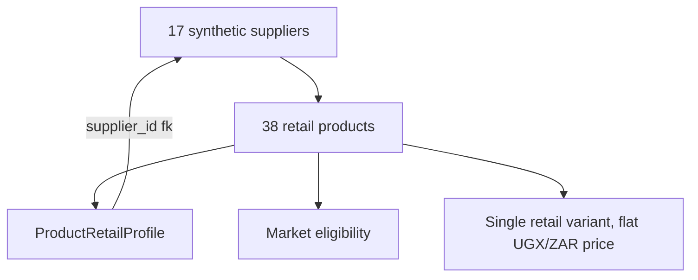

# Thamani B2C Foundation (Gates 0-6)

Thamani is a second, coexisting Baobab Digital Estate on this same Trade
engine instance — not a second storefront against ZuriBeans' B2B commercial
model, and not a marketplace. This document is the historical Gate 0-6
foundation record: Discovery through the initial retail catalogue. For
current completion status, use
`docs/plans/thamani-b2c-completion-plan.md` and the later Gate-specific
architecture documents.

## Gate 0 — Discovery

At the time this work started, `baobab-trade` already carried a complete
ZuriBeans B2B implementation through Gate 9 (Fulfilment): Medusa 2.20.1,
Control Plane context resolution, `zuribeans_ug`/`zuribeans_za` Markets, a
typed `b2b` module, a ten-product wholesale catalogue, inventory bridging,
payment policy, and fulfilment policy — each documented under
`docs/architecture/` and gated behind its own CI integration job. See
`docs/architecture/baobab-context.md`, `market-model.md`,
`zuribeans-b2b-commerce.md`, `zuribeans-catalogue-pricing.md`,
`zuribeans-inventory.md`, `zuribeans-payments.md`, and
`zuribeans-fulfilment.md` for that prior state, which this work leaves
intact.

Two Medusa constraints not previously exercised (ZuriBeans is the only
estate on this engine until now) surfaced while building Thamani and shaped
the Market bootstrap below:

- Medusa allows **at most one Region per country store-wide** — two Digital
  Estates cannot each provision their own Region for Uganda.
- Medusa requires **globally unique Fulfillment Service Zone names** — not
  merely unique within one Fulfillment Set.

## Gate 1 — Core Medusa Health

No code changes. `npm run verify:core-modules` already probes Product,
Pricing, Customer, Cart, Order, Inventory, Stock Location, Region, Sales
Channel, Currency, Payment, Fulfillment, Tax, Auth, API Key, and Store
read-paths, and is estate-agnostic: it is unaffected by Thamani's addition
and continues to pass.

## Gate 2 — Production Infrastructure

No code changes. `src/baobab/config/infrastructure.ts` (Redis event bus,
Redis workflow engine, Redis locking, Redis caching, S3 file storage,
SendGrid notifications) is entirely estate-agnostic and already covers
Thamani. Meilisearch remains **PLANNED** for Gate 7 (Search).

## Gate 3 — Baobab Context

`src/baobab/context/resolver.ts`'s `resolveCommerceContext` already took a
`digitalEstateCanonicalId` as an explicit selection input (never inferred),
and `src/baobab/contracts/market.ts`'s `MarketType` already included `"B2C"`
alongside `"B2B"` — this boundary was built estate-agnostic from Gate 3's
first implementation. The only addition is
`src/baobab/context/digital-estates.ts`, naming the two canonical Digital
Estate IDs a trusted route or deployment policy selects between:

```ts
ZURIBEANS_DIGITAL_ESTATE_CANONICAL_ID = "estate:zuribeans-b2b"
THAMANI_DIGITAL_ESTATE_CANONICAL_ID = "estate:thamani-b2c"
```

No other Gate 3 code changed. Isolation invariants documented in
`baobab-context.md` (Market ownership, Legal Seller/Digital Estate required,
ACTIVE-only mapping resolution) apply identically to both estates.

## Gate 4 — Uganda and South Africa Markets



`src/baobab/market/thamani-market-config.ts` defines `thamani_ug` and
`thamani_za` as candidate Market keys — distinct from ZuriBeans' — with
their own `thamani_b2c` Sales Channel and their own Stock Locations
(Kampala Central Warehouse UG-KLA-01; Cape Town Distribution Warehouse
ZA-CPT-01). The additional facilities named in the wider brief (a second
Uganda import-staging location; Johannesburg and Durban in South Africa)
are explicitly deferred to Gate 10 (Inventory).

The Region and Tax Region provisioning step in
`src/baobab/market/provisioning.ts` (extracted from the former
ZuriBeans-only `bootstrap-market.ts` so both estates share it) now looks up
an existing Region **by country code**, not by the `baobab_market_key` tag:
whichever estate provisions a country's Region first, the other reuses it
(after checking the currency matches) rather than failing on Medusa's
one-Region-per-country constraint. Sales Channels and Stock Locations remain
estate-specific with no such constraint. Thamani's Fulfillment Service Zones
are named `"Thamani Uganda Domestic"` / `"Thamani South Africa Domestic"` to
stay globally unique against ZuriBeans' `"Uganda Domestic"` /
`"South Africa Domestic"`.

Run `npm run bootstrap:thamani-market` (idempotent, requires
`bootstrap:market` or its own prior run to have provisioned each country's
Region and Tax Region — either order works) and
`npm run verify:thamani-market`, which also asserts the two estates never
end up sharing one Sales Channel.

No hardcoded UUIDs, no Baobab Market registered with Control Plane yet
(candidate keys only, matching the ZuriBeans precedent), no tax rates or
shipping prices seeded.

## Gate 5 — B2C Customer Experience

`src/baobab/thamani/customer/` is a policy-only layer (no new persisted
models — Medusa's native Customer, Address, and Cart already support guest
and registered checkout):

- **No B2B Organisation membership.** `ThamaniConsumerCustomer` carries no
  `organisationId`/`membershipId`; `assertConsumerCustomer` fails closed if
  either field is ever present on a consumer record.
- **Guest and registered checkout resolve identical Commerce Context.**
  `assertCheckoutContextResolved` requires Market, currency, Legal Seller,
  resolved tax context, at least one payment provider, and at least one
  fulfilment option — regardless of `checkoutMode`. Authentication state
  never substitutes for Commerce Context.
- **Minimal registration data.** `assertValidRegistration` accepts only
  `email`, `firstName`, `lastName`, `phone` (required for both launch
  Markets, for courier/mobile-money delivery coordination),
  `marketingConsent`, and `preferredMarketKey`; `assertNoUnapprovedFields`
  rejects any other field outright rather than silently ignoring it.
- **Consent tracking.** `recordConsent`/`hasConsent` upsert per-purpose
  (`MARKETING`, `ANALYTICS`) consent records.
- **Privacy-safe projections.** `toLogSafeProjection` masks the email
  address; `toAnalyticsSafeProjection` strips every identifying field.
  Neither belongs in Ledger records.

## Gate 6 — Retail Catalogue



`src/modules/thamani` is a new typed Medusa module — `Supplier`,
`ProductRetailProfile`, `MarketProductEligibility` — mirroring the ZuriBeans
`b2b` module's pattern of extending Medusa's native Product with typed
records for concerns the core model doesn't carry, never a second Product
authority. A Supplier here is procurement/provenance metadata only; it is
never a Medusa seller account, storefront, or settlement counterparty (spec
§23; Thamani is not a marketplace).

`src/baobab/thamani/suppliers/supplier-config.ts` defines 17 explicitly
synthetic suppliers spanning food manufacturers, coffee roasters, FMCG
distributors, personal-care and household-goods manufacturers, regional
wholesalers, importers, local SMEs, and agricultural cooperatives across
Uganda, South Africa, Kenya, and import origins (India, Vietnam, Brazil, the
Netherlands). One entry, `sup_zuribeans_external`, represents the real
sibling ZuriBeans B2B estate as one optional supplier — never the default —
with no live procurement integration yet.

`src/baobab/thamani/catalogue/catalogue-config.ts` defines 38 retail
products across the eight governed categories (Coffee & Tea 6, Chocolate &
Confectionery 4, Spices & Seasonings 5, Pantry Staples 6, Natural Foods 4,
Personal Care 5, Household 4, Lifestyle 4). Unlike ZuriBeans' wholesale
catalogue, each product has one single-unit retail variant, a flat UGX/ZAR
price with no volume tiers or MOQ, and independent per-Market pricing (never
`za = ug * fx`). `TH-COF-001` (Uganda Arabica Ground Coffee) is sourced from
ZuriBeans; every other coffee/tea product is sourced independently,
demonstrating that no code treats "coffee supplier = ZuriBeans" as an
invariant. `TH-SPI-003` (Vanilla Extract) is a deliberately distinct product
identity from ZuriBeans' whole cured vanilla pods. Two products
(`TH-LIF-001` Uganda-only, `TH-LIF-002` South Africa-only) are deliberately
single-Market to exercise catalogue isolation ahead of Gate 7 (Search).

HS classification references, customs categories, and tax categories are
illustrative reference data for exercising the commerce model — real
customs-classification validation remains Gate 14 (Cross-Border Trade
Readiness) work, not this foundation slice.

Run `npm run bootstrap:thamani-catalogue` (idempotent; requires
`bootstrap:thamani-market` to have run first) and
`npm run verify:thamani-catalogue`, which also asserts the two single-Market
SKUs resolve to exactly the one Market each was configured for.

## Status at the end of Gate 6

Everything from Gate 7 onward in the wider brief — Search/Meilisearch,
pricing depth (sale/campaign prices), Promotions, full multi-location
Inventory, regional Payment providers, Fulfilment providers, Tax provider
integration and inclusive/exclusive display policy, Cross-Border Trade
readiness (`TradeCompliancePort`), ERP integration, the canonical event/
outbox contract, Store Credit, and the Uganda-South Africa simulation
dataset — was **PLANNED** at the end of this foundation slice. This section
is retained as historical scope evidence; it is not the current status report.
