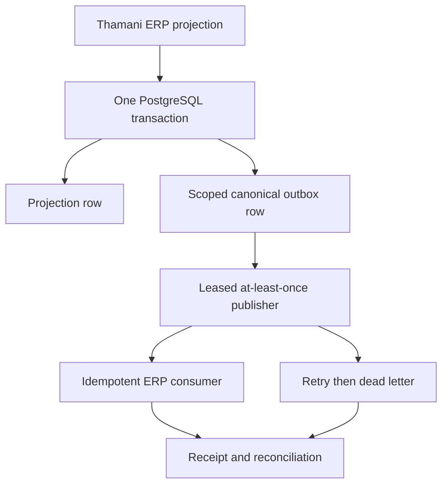

# Thamani canonical events and transactional outbox

Gate 16 extends the existing Baobab Trade event infrastructure without sharing business ownership between Thamani and ZuriBeans. Code and infrastructure are reusable; Tenant, owning legal entity, Digital Estate, Market, legal seller, idempotency namespace, consumer receipts, and reconciliation are not.

## Durable boundary

The Gate 15 ERP projection insert activates a database trigger only for the `thamani:erp:` namespace. PostgreSQL validates the Thamani Market/legal-seller pair and inserts the canonical outbox envelope in the same transaction. A failed outbox insert therefore fails the ERP projection insert. This closes the dual-write window even when callers use Medusa's generated module service directly.

| Scope                 | Required value                                             |
| --------------------- | ---------------------------------------------------------- |
| Tenant projection     | `tenant-thamani` pending Control Plane registration        |
| Owning legal entity   | `thamani`                                                  |
| Digital Estate        | `estate:thamani-b2c` (Control Plane canonical ID)          |
| Markets               | `thamani_ug`, `thamani_za`                                 |
| Legal sellers         | `thamani-uganda`, `thamani-south-africa`, paired to Market |
| Idempotency namespace | `thamani:erp:*` / `thamani:event:*`                        |

These candidate keys are engine projections, not authority. The Control Plane remains authoritative and must replace/reconcile them when canonical registrations are activated.

Seven specific facts cover product, supplier, warehouse, order, shipment, payment, and return/refund projections. Events carry references and committed facts, never customer profiles, addresses, credentials, card data, or raw provider payloads. Global ordering is not assumed; correlation, causation, canonical aggregate identity, and source version provide lineage.

Delivery is at least once. Dispatch uses bounded batches, leases, exponential backoff, a maximum attempt count, and an inspectable dead-letter state. Material consumers persist the side effect and receipt atomically and deduplicate by consumer plus event ID. Dead letters do not rewrite Commerce or ERP state; authorised recovery creates a reconciled operational action.
