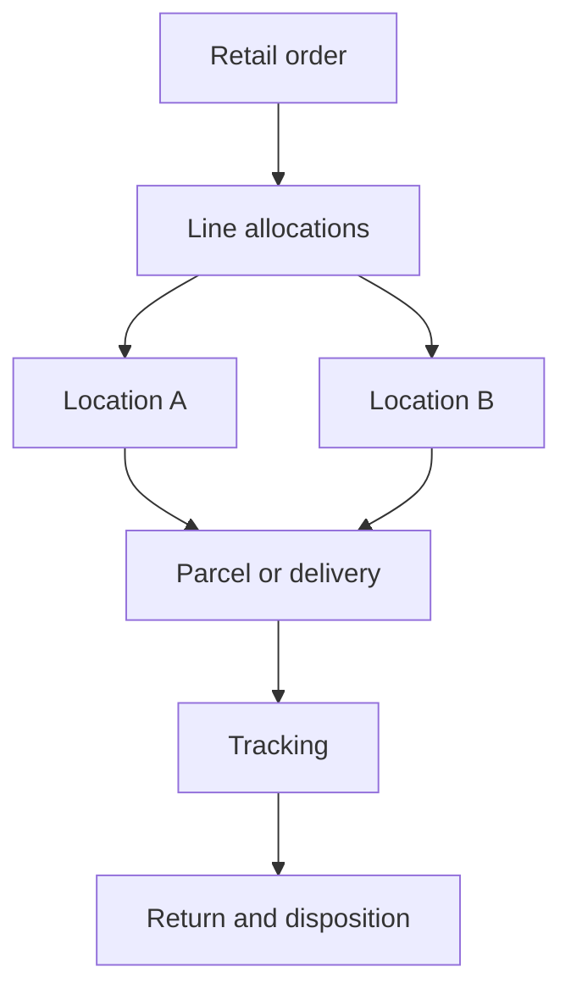

# Thamani B2C Fulfilment (Gate 12)

Thamani supports local delivery, parcel shipment and customer pickup through a provider-neutral Medusa fulfilment boundary. Live courier adapters remain disabled until contracts, credentials, service areas, rates, webhook security and operational ownership are approved.

An order line may be allocated across several Thamani locations, but the allocation set must cover each line exactly: no shortage, overshipment or unknown line. Authoritative fulfilled quantities are persisted first; composite foreign keys reject unknown lines and a deferred database constraint validates the complete allocation set at transaction commit. This preserves partial-fulfilment execution without losing order-level accountability.

Fulfilment requires exactly one party reference: a B2B organisation or a B2C customer. Dispatch and delivery transitions require authoritative evidence. Tracking references are operational projections, not invented delivery proof.

Returns are quantity-bounded, reason-coded and assigned an explicit disposition: restock, quarantine, dispose or inspect. A database trigger atomically advances the authoritative line's returned-quantity counter and prevents concurrent requests from exceeding fulfilment. Domain validators fail early for callers, while the database remains the final enforcement boundary. A return does not itself authorize a refund; Gate 11's payment boundary owns that consequence.

Run `npm run bootstrap:thamani-fulfilment` after migrations and `npm run verify:thamani-fulfilment` in an integration environment.
