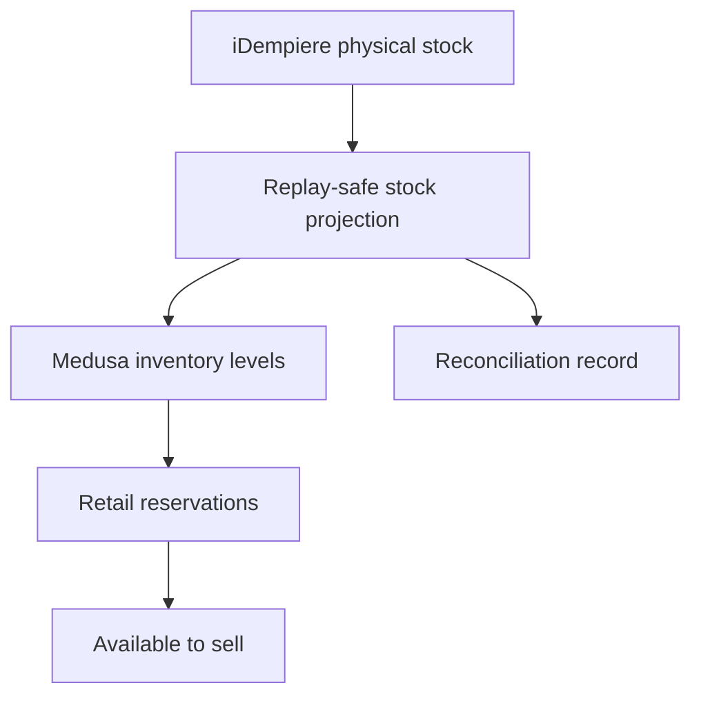

# Thamani B2C Inventory (Gate 10)

Gate 10 gives Thamani its own commerce inventory locations and availability projection while preserving iDempiere as the future enterprise physical-stock and accounting authority. Medusa owns retail reservations and checkout availability; it does not become an inventory ledger.

## Locations and isolation

| Market       | Canonical location | Purpose                   | Gate 4 primary reused |
| ------------ | ------------------ | ------------------------- | --------------------- |
| Uganda       | `TH-UG-KLA-01`     | Kampala retail warehouse  | Yes                   |
| Uganda       | `TH-UG-EBB-01`     | Entebbe import staging    | No                    |
| South Africa | `TH-ZA-CPT-01`     | Cape Town distribution    | Yes                   |
| South Africa | `TH-ZA-JNB-01`     | Johannesburg distribution | No                    |
| South Africa | `TH-ZA-DUR-01`     | Durban import staging     | No                    |

The `TH-` prefix is intentional: Thamani does not silently reuse ZuriBeans commerce locations merely because both estates may eventually map to facilities in the same enterprise network. Each location carries Digital Estate, Market, canonical-location, and ERP-reference breadcrumbs. Engine UUIDs remain implementation identifiers.

Only locations in a product's configured eligible Markets receive inventory levels. This makes the catalogue's Uganda-only and South-Africa-only test products useful isolation canaries. All other launch products receive levels at all five locations.

## Reservations and reconciliation

`MedusaInventoryAvailabilityAdapter` remains the native-in-Medusa implementation of `InventoryAvailabilityPort`. Gate verification creates and releases a real reservation and proves available-to-sell falls and recovers. Initial ERP projections use stable idempotency keys and reconciliation records expose variance; they do not conceal it by overwriting either side. Verification accepts a correctly calculated `VARIANCE` (including stock left by an earlier integration scenario) and rejects inconsistent delta/status pairs.

Run `npm run bootstrap:thamani-inventory` after the Thamani Market and catalogue bootstraps. Run `npm run verify:thamani-inventory` for an integration check (it briefly creates and releases one reservation).
