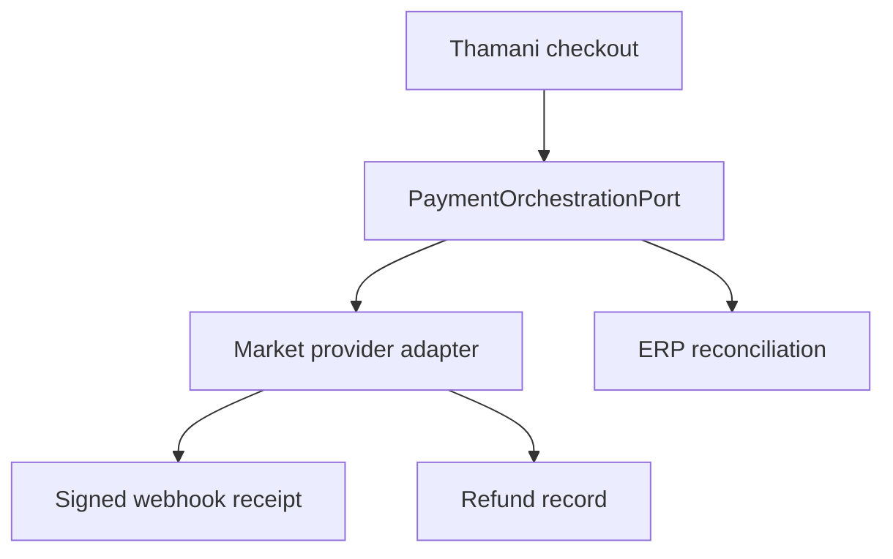

# Thamani B2C Payments (Gate 11)

Thamani uses prepaid consumer electronic payments. It does not inherit ZuriBeans invoice terms, and it does not embed one provider's protocol into checkout.

## Launch policy

| Market       | Currency | Enabled development binding | Prepared production adapters |
| ------------ | -------- | --------------------------- | ---------------------------- |
| Uganda       | UGX      | Medusa system sandbox       | MTN MoMo, Airtel Money       |
| South Africa | ZAR      | Medusa system sandbox       | Peach Payments               |

Regional adapters are intentionally disabled until credentials, contracts, provider certification, callback URLs, and operational ownership are approved. The system binding proves orchestration without masquerading as a live payment rail.

All Thamani policies allow only `PREPAID`. Payment initiation requires exactly one party reference: a B2B organisation or B2C customer, never both. Amounts are positive safe integers in the transaction currency's minor-unit representation.

## Webhooks

The provider boundary signs the exact raw body with HMAC-SHA-256 over `timestamp.body`, compares signatures in constant time, rejects timestamps outside a five-minute replay window, and persists the provider/event identity under a unique constraint. Only a SHA-256 payload digest is stored in the receipt; raw payment payloads and consumer PII are excluded.

Provider-specific adapters may use a different signature scheme, but must preserve the same outcomes: authenticity, freshness, deduplication, immutable raw-body verification, and fail-closed processing.

## Refunds and reconciliation

Refunds are currency-locked, idempotent, reason-coded, and cannot exceed the unrefunded captured amount. Refund success in a provider does not silently imply ERP posting. Payment and refund consequences remain explicitly reconcilable with iDempiere.

Run `npm run bootstrap:thamani-payments` after migrations and `npm run verify:thamani-payments` in an integration environment.
