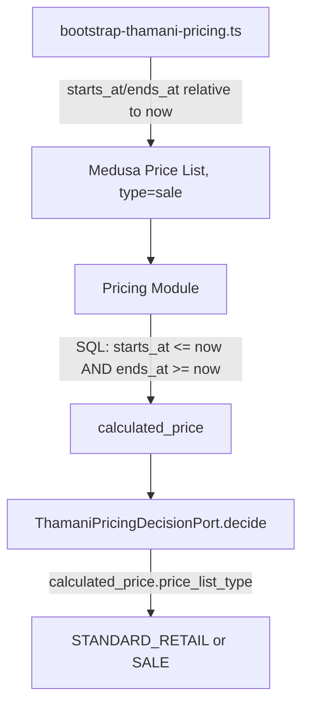

# Thamani B2C Retail Pricing

## Gate 8 outcome

Market-specific retail pricing was already established in Gate 6 — every
Thamani product carries independent UGX and ZAR amounts, never one derived
from the other by FX (spec §29). Gate 8 adds the one dimension Gate 6 didn't
cover: scheduled, effective-dated **sale** pricing, plus the
`ThamaniPricingDecisionPort` boundary a future checkout calls instead of
reading Medusa Pricing directly.

## Why not the ZuriBeans `PricingDecisionPort`

`src/baobab/pricing/decision-port.ts` is the ZuriBeans B2B port —
organisation-scoped, volume-tiered (`STANDARD_WHOLESALE`, `VOLUME`,
`CONTRACT`, `CUSTOMER_SPECIFIC`), with `assertOrderQuantity`/MOQ semantics
that have no B2C equivalent. Reusing it would mean bolting retail concepts
onto a B2B-shaped interface. `src/baobab/thamani/pricing/decision-port.ts` is
a separate, B2C-shaped port — the same reuse-vs-fork call already made for
`thamani/customer` and `thamani/market-config` in earlier gates.

## Architecture

`ThamaniPricingKind` is `"STANDARD_RETAIL" | "SALE"` — no separate
`MARKET_SPECIFIC` kind, since Market-specific pricing is the `currencyCode`
selection itself (Gate 6), not an overlay on top of it. `CAMPAIGN`
(percentage/code-based discounting) is Gate 9 (Promotions) scope: a
Medusa Price List is a pricing-level, scheduled/segmented price, distinct
from the Promotion module's rule-based discounts applied at cart time.

## Effective dating is Medusa's, not ours

Medusa's Pricing repository filters Price-List-derived prices by
`(starts_at IS NULL OR starts_at <= now()) AND (ends_at IS NULL OR ends_at >=
now())` directly in SQL when computing `calculated_price`. Neither
`bootstrap-thamani-pricing.ts` nor `ThamaniPricingDecisionPort` does its own
date-window filtering — the adapter only classifies Medusa's own result via
`calculated_price.calculated_price.price_list_type`, the same field Medusa's
own cart workflow (`update-line-item-in-cart.js`) uses to detect a sale
price. A Price List's `type` is left unset on create: the model defaults it
to `PriceListType.SALE`, which is what the classifier looks for.

## The three demonstration sales

`src/baobab/thamani/pricing/sale-config.ts` declares one sale per
`SaleWindowKind` (`ACTIVE`, `UPCOMING`, `EXPIRED`), each on a different
product across categories. `resolveSaleWindow` computes concrete
`starts_at`/`ends_at` relative to wall-clock time at bootstrap time — not
literal hardcoded dates that would go stale — so re-running
`bootstrap:thamani-pricing` on any date keeps `ACTIVE` active, `UPCOMING`
not yet started, and `EXPIRED` already ended. `verify:thamani-pricing`
asserts all three resolve correctly: the `ACTIVE` sale returns `SALE` at its
configured discounted amount; `UPCOMING` and `EXPIRED` both return
`STANDARD_RETAIL` at the ordinary Gate 6 catalogue price, proving Medusa
excludes a Price List outside its window rather than merely deprioritising
it.

## What Gate 8 does not do

Percentage/code-based discounts, campaigns, minimum-cart thresholds, and
customer-group pricing are Gate 9 (Promotions). Reconciling a sale
`THAMANI_SALES` entry that changes after its Price List already exists
(adding a new sale product to an existing window kind) is not handled by
`bootstrap-thamani-pricing.ts` — the fixture is static, and a genuine
catalogue change of this kind is expected to ship with a fresh bootstrap
run against a clean database, as CI does.
