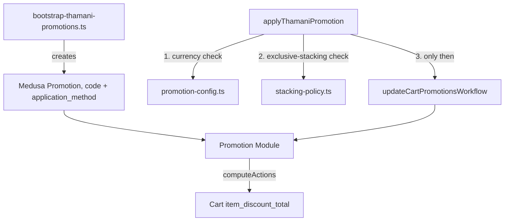

# Thamani B2C Promotions

## Gate 9 outcome

Gate 9 adds percentage/code-based discounting on top of Gate 6's standard
retail catalogue and Gate 8's scheduled sale pricing, using Medusa's native
Promotion module (`engine-boundaries.md`: Promotions = NATIVE-IN-MEDUSA — no
separate Baobab Promotion Engine). There is no ZuriBeans equivalent to fork
from: B2B never built Promotions, so `src/baobab/thamani/promotions/` is a
fresh boundary, not a reuse-vs-fork call like every earlier Thamani gate.

## Why a Promotion is not a Price List

ADR-0012 §31: "A Promotion SHALL represent a temporary or conditional
commerce incentive... Promotions SHALL remain distinct from permanent or
contractual Price Lists." Gate 8's Price Lists are a scheduled/segmented
_price_, resolved automatically by `calculated_price` for anyone who queries
that variant in that Market. A Promotion is a cart-time _rule-based
discount_ that only ever applies once a customer's Cart carries its code —
nothing resolves it ambient to a bare variant query the way `SALE` pricing
does.

## Architecture

`src/baobab/thamani/promotions/promotion-config.ts` declares the two
demonstration Promotions and `assertPromotionCurrencyMatchesCart`;
`stacking-policy.ts` declares `assertExclusivePromotionStacking`; both are
pure and unit-tested without booting Medusa. `apply-promotion.ts` is the
single call site a future checkout uses to add a code to a Cart — it runs
both checks and fails closed _before_ ever calling Medusa's own
`updateCartPromotionsWorkflow`, since that workflow enforces neither on its
own.

## Two Baobab policies Medusa does not enforce

**Market/currency scope (ADR-0012 §32).** Medusa's Promotion module does
not refuse to compute a `fixed` discount against a cart whose currency
differs from the promotion's own `application_method.currency_code` — it
would silently subtract the raw numeric `value` regardless of currency. This
is the same "an incorrectly scoped promotion is a financial defect" failure
mode `ThamaniPricingDecisionPort` (Gate 8) already guards against for
prices; `assertPromotionCurrencyMatchesCart` is the same guard for
Promotions.

**Exclusive stacking (ADR-0012 §34).** "Baobab SHALL define deterministic
rules governing whether multiple promotions may combine. The chosen policy
SHALL be explicit and testable." Medusa's Promotion module has no native
stacking/exclusivity concept: `updateCartPromotionsWorkflow` will happily
compute actions for as many simultaneously-applied codes as a caller
requests. Thamani's policy is **exclusive** — at most one Promotion per
cart — the conservative default ADR-0012 recommends where economics are
sensitive. `assertExclusivePromotionStacking` enforces it.

## The two demonstration promotions

`src/baobab/thamani/promotions/promotion-config.ts` declares `THAMANI10`
(10% off, UGX) and `THAMANIFIXED2000` (2,000 UGX flat off, UGX), each
`allocation: "across"` — Medusa's own validation requires an explicit
`max_quantity` for `"each"`/`"once"` allocation, which this demonstration
scope does not need. `verify:thamani-promotions` checks both exist with the
declared `application_method` configuration; it is read-only and safe to
run against any environment.

## Proving it actually computes, not just that the config is right

Medusa Promotions only ever compute a discount against a Cart, unlike
`ThamaniPricingDecisionPort`, which needs only a bare variant. Proving
`THAMANI10`/`THAMANIFIXED2000` compute the right amount, and that
`assertExclusivePromotionStacking` actually blocks a second code, requires
creating a real Cart — a mutation. Following the lesson Gate 7's review
caught (a mutating scenario must not live inside a read-only "verify"
health check), this lives in its own
`regression-thamani-promotion-application.ts`, run as a distinct CI step,
never as part of `verify:thamani-promotions`. It creates two disposable test
Carts in the Thamani Uganda Region, applies each promotion, asserts the
computed `item_discount_total`, confirms a second code is rejected on the
first cart, then deletes both Carts. It must only run against a disposable
database.

Thamani has no Gate 10 (Inventory) yet, so its catalogue variants
(`manage_inventory: true`) have no stock level anywhere and
`createCartWorkflow` refuses to add a line item for them. The regression
gives just its two demonstration variants a stock level at Thamani Uganda's
own location as its own setup step — this is scoped strictly to making the
regression's Carts creatable, not a Gate 10 implementation.

### A Medusa `query.graph` quirk worth documenting

Requesting `item_discount_total` alone from `query.graph({ entity: "cart",
... })` silently omits it from the result — Medusa's cart-totals decoration
only runs when at least one other top-level total field (`total`,
`subtotal`) is also requested. The regression's `readCartItemDiscount`
requests `total`/`subtotal` alongside it for exactly this reason. Cart
totals also come back as `BigNumberValue` (a stringified decimal), not a
plain JS number — comparisons normalise with `Number(...)` first.

## What Gate 9 does not do

Buy-X-get-Y and bundle discounts (`PromotionTypeValues: "buyget"` exists in
Medusa but is unused here), coupon abuse-prevention/rate-limiting (ADR-0012
§75), atomic concurrent-redemption limits (§78), customer-segment-scoped
promotions (Thamani has no customer segments yet), and B2B contract-price
interaction (§35 — not applicable: Thamani never touches ZuriBeans contract
pricing) are all out of scope. Best-price-wins or priority-based stacking
were considered and explicitly rejected in favour of exclusive, the
ADR-recommended conservative default; revisiting that policy is a deliberate
future decision, not an oversight.
