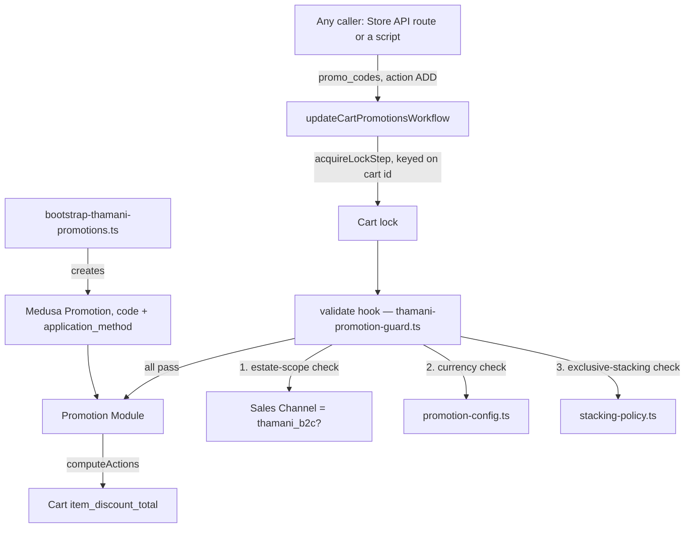

# Thamani B2C Promotions

## Gate 9 outcome

Gate 9 adds percentage/code-based discounting on top of Gate 6's standard
retail catalogue and Gate 8's scheduled sale pricing, using Medusa's native
Promotion module (`engine-boundaries.md`: Promotions = NATIVE-IN-MEDUSA — no
separate Baobab Promotion Engine). There is no ZuriBeans equivalent to fork
from: B2B never built Promotions, so `src/baobab/thamani/promotions/` is a
fresh boundary, not a reuse-vs-fork call like every earlier Thamani gate.

## Why a Promotion is not a Price List

ADR-0012 §31: "A Promotion SHALL represent a temporary or conditional
commerce incentive... Promotions SHALL remain distinct from permanent or
contractual Price Lists." Gate 8's Price Lists are a scheduled/segmented
_price_, resolved automatically by `calculated_price` for anyone who queries
that variant in that Market. A Promotion is a cart-time _rule-based
discount_ that only ever applies once a customer's Cart carries its code —
nothing resolves it ambient to a bare variant query the way `SALE` pricing
does.

## Architecture

`src/baobab/thamani/promotions/promotion-config.ts` declares the two
demonstration Promotions, `assertPromotionCurrencyMatchesCart`, and
`ThamaniCartEstateMismatchError`; `stacking-policy.ts` declares
`assertExclusivePromotionStacking`. The currency and stacking checks are
pure functions, unit-tested without booting Medusa; the estate-scope check
needs a Sales Channel lookup, so it is inlined directly in the hook (below)
rather than factored into its own pure function.

**The enforcement point is a workflow hook, not a wrapper function.** An
earlier version of this fix put the three checks in a standalone
`applyThamaniPromotion(container, cartId, code)` function that a future
checkout would have to remember to call instead of Medusa's own
`updateCartPromotionsWorkflow`. A review caught that this was bypassable
three separate ways (see "Three findings on the first version" below), all
stemming from the same root cause: the checks lived next to the workflow,
not inside it. `src/workflows/thamani-promotion-guard.ts` registers a
`validate` hook directly on `updateCartPromotionsWorkflow` as a side effect
of being imported — Medusa's `WorkflowLoader` auto-imports every file under
`src/workflows/` on boot ("workflows register themselves... we only need to
import them"). This makes the checks apply to _every_ caller of that
workflow, Medusa's own Store API route (`POST /store/carts/:id/promotions`)
included, and — because `acquireLockStep` (keyed on the cart id) runs before
the `validate` hook fires — the checks run serialized per-cart under
Medusa's own lock, not as a separate racy pre-check.

## Three Baobab policies Medusa does not enforce

**Digital Estate scope.** ZuriBeans Uganda and Thamani Uganda share the same
Region _and_ the same currency (UGX) — they only differ by Sales Channel.
Nothing about a Cart's `currency_code` identifies which Digital Estate it
belongs to. The `validate` hook resolves the cart's Sales Channel and
requires its `baobab_sales_channel_key` metadata breadcrumb (the same
tagging convention every other Thamani gate uses) to equal
`THAMANI_SALES_CHANNEL_KEY` (`"thamani_b2c"`) before any Thamani promotion
may be applied, throwing `ThamaniCartEstateMismatchError` otherwise —
without this, a ZuriBeans B2B cart could redeem a Thamani consumer discount
code.

**Market/currency scope (ADR-0012 §32).** Medusa's Promotion module does
not refuse to compute a `fixed` discount against a cart whose currency
differs from the promotion's own `application_method.currency_code` — it
would silently subtract the raw numeric `value` regardless of currency. This
is the same "an incorrectly scoped promotion is a financial defect" failure
mode `ThamaniPricingDecisionPort` (Gate 8) already guards against for
prices; `assertPromotionCurrencyMatchesCart` is the same guard for
Promotions.

**Exclusive stacking (ADR-0012 §34).** "Baobab SHALL define deterministic
rules governing whether multiple promotions may combine. The chosen policy
SHALL be explicit and testable." Medusa's Promotion module has no native
stacking/exclusivity concept: `updateCartPromotionsWorkflow` will happily
compute actions for as many simultaneously-applied codes as a caller
requests — including several codes submitted in a single request, which
`assertExclusivePromotionStacking` also catches by simulating the codes
being applied one at a time against the running set. Thamani's policy is
**exclusive** — at most one Promotion per cart — the conservative default
ADR-0012 recommends where economics are sensitive.

## Three findings on the first version

A review of the wrapper-function version of this fix (before it moved into
a workflow hook) found it was bypassable three ways, all now closed by
hooking the workflow directly instead:

1. **Store API bypass.** Medusa's own `POST /store/carts/:id/promotions`
   route calls `updateCartPromotionsWorkflow` directly; nothing routed
   Store API traffic through the wrapper at all.
2. **Estate-scope gap.** The wrapper checked only `cart.currency_code`, not
   the cart's Sales Channel — ZuriBeans Uganda and Thamani Uganda share a
   currency, so this let a ZuriBeans cart redeem a Thamani code.
3. **TOCTOU race.** The wrapper read the cart's already-applied promotions
   as a separate query _before_ calling the workflow, which acquires its
   own lock — two concurrent requests for two different codes on the same
   empty cart could both read an empty `promotions` list and both pass the
   stacking check before either write landed.

## The two demonstration promotions

`src/baobab/thamani/promotions/promotion-config.ts` declares `THAMANI10`
(10% off, UGX) and `THAMANIFIXED2000` (2,000 UGX flat off, UGX), each
`allocation: "across"` — Medusa's own validation requires an explicit
`max_quantity` for `"each"`/`"once"` allocation, which this demonstration
scope does not need. `verify:thamani-promotions` checks both exist with the
declared `application_method` configuration; it is read-only and safe to
run against any environment.

## Proving it actually computes, not just that the config is right

Medusa Promotions only ever compute a discount against a Cart, unlike
`ThamaniPricingDecisionPort`, which needs only a bare variant. Proving
`THAMANI10`/`THAMANIFIXED2000` compute the right amount, that
`assertExclusivePromotionStacking` actually blocks a second code, and that a
ZuriBeans cart cannot redeem a Thamani code, requires creating real Carts —
a mutation. Following the lesson Gate 7's review caught (a mutating scenario
must not live inside a read-only "verify" health check), this lives in its
own `regression-thamani-promotion-application.ts`, run as a distinct CI
step, never as part of `verify:thamani-promotions`. It creates disposable
test Carts in the Thamani Uganda Sales Channel (and, for the estate-scope
case, the ZuriBeans Uganda Sales Channel), applies promotion codes via
Medusa's own `updateCartPromotionsWorkflow` directly — not a wrapper, since
proving the hook guards the real workflow entry point is the whole point —
asserts the computed `item_discount_total`, then deletes every Cart it
created. It must only run against a disposable database.

Thamani has no Gate 10 (Inventory) yet, so its catalogue variants
(`manage_inventory: true`) have no stock level anywhere and
`createCartWorkflow` refuses to add a line item for them. The regression
gives just its two demonstration variants a stock level at Thamani Uganda's
own location as its own setup step — this is scoped strictly to making the
regression's Carts creatable, not a Gate 10 implementation.

### Two Medusa quirks worth documenting

Requesting `item_discount_total` alone from `query.graph({ entity: "cart",
... })` silently omits it from the result — Medusa's cart-totals decoration
only runs when at least one other top-level total field (`total`,
`subtotal`) is also requested. The regression's `readCartItemDiscount`
requests `total`/`subtotal` alongside it for exactly this reason. Cart
totals also come back as `BigNumberValue` (a stringified decimal), not a
plain JS number — comparisons normalise with `Number(...)` first.

An error thrown _inside_ a workflow step — which is what a `validate` hook
consumer is — does not reach `.run()`'s caller as the original error
instance. Medusa's transaction orchestrator round-trips it through its own
checkpoint state, and what comes out the other side is a plain object
(`error.constructor.name === "Object"`; `instanceof` no longer matches the
original class) that keeps `.name`, `.message`, and any custom own-
enumerable fields intact. The regression checks `error.name === "..."`
rather than `instanceof` for exactly this reason — an `instanceof` check
here would silently never match and the regression would report the wrong
failure.

## What Gate 9 does not do

Buy-X-get-Y and bundle discounts (`PromotionTypeValues: "buyget"` exists in
Medusa but is unused here), coupon abuse-prevention/rate-limiting (ADR-0012
§75), atomic concurrent-redemption limits (§78), customer-segment-scoped
promotions (Thamani has no customer segments yet), and B2B contract-price
interaction (§35 — not applicable: Thamani never touches ZuriBeans contract
pricing) are all out of scope. Best-price-wins or priority-based stacking
were considered and explicitly rejected in favour of exclusive, the
ADR-recommended conservative default; revisiting that policy is a deliberate
future decision, not an oversight.
