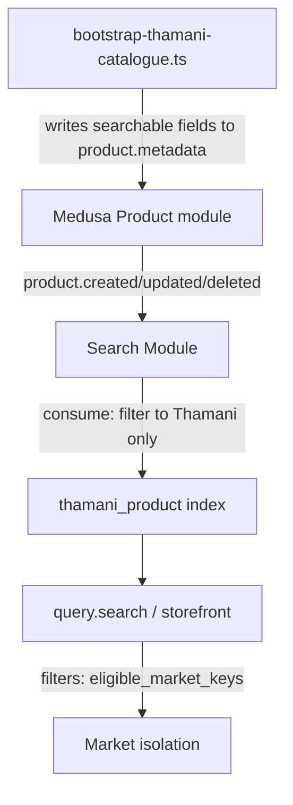

# Thamani B2C Search

## Gate 7 outcome

Gate 7 indexes the Thamani retail catalogue for keyword search, category
facets, and Market-scoped filtering, using Medusa's native Search Module
(`@medusajs/medusa/search`) with its built-in Postgres-backed provider
(`@medusajs/medusa/search-postgres`) — no external search service is
provisioned for this gate. Search remains a projection: it never becomes
Product authority, and every field it serves traces back to what
`bootstrap-thamani-catalogue.ts` already wrote to the product.

## Why the native Postgres provider, not Meilisearch yet

The wider brief names Meilisearch as the target engine. Medusa's Search
Module is explicitly provider-pluggable for exactly this reason — its own
type documentation names Meilisearch and Algolia alongside Postgres as
interchangeable engines behind the same `ISearchProvider` contract. Adding a
live Meilisearch dependency now would mean provisioning and running a new
service this repository does not yet operate anywhere (dev, CI, or
production), for a catalogue of 38 products where Postgres full-text search
already exercises every capability this gate requires: keyword matching,
filters, facets, sorting, and event-driven updates. Swapping providers later
is a `medusa-config.ts` change — register the Meilisearch provider package
and give the `thamani_product` index (or the module's `default_provider`) its
identifier — not a change to the index definition in `src/search/`.

## Architecture

`src/search/thamani-product-index.ts` declares the `thamani_product` index
against the `product` entity. Both `consume` (event-driven updates) and
`seed` (full reindex) delegate to pure functions in
`src/baobab/thamani/search/projection.ts` — `isThamaniProduct` and
`toThamaniSearchDocument` — which are unit-tested without booting Medusa.

### Why fields live on `product.metadata`, not a module link

This Trade engine instance also serves ZuriBeans B2B on the same Product
module. Thamani-specific facets (category, brand, country of origin,
supplier, per-Market eligibility) live in the typed `thamani` module's own
tables (`src/modules/thamani`), not on core Product. The Search Module hands
`consume`/`seed` only a minimal container (`{ query }`) by design, with no
route to resolve an arbitrary module service — so reaching those fields
requires either a Medusa Module Link between Product and `thamani`'s tables,
or writing them onto the product's own `metadata` at catalogue-bootstrap
time. This repository already uses `metadata` as the established idiom for
Baobab-specific breadcrumbs on native Medusa records (Market-key tags on
Regions/Sales Channels/Stock Locations, canonical product keys on
ZuriBeans products); Gate 7 extends the same idiom rather than introducing
Module Links as new machinery nothing else in the codebase yet uses.
`bootstrap-thamani-catalogue.ts`'s `searchProjectionMetadata` writes these
fields on every run (not only at creation), so a later catalogue change
reaches the index without a manual metadata migration. `thamani`'s own
module tables remain the authority; `metadata` is the search projection's
read model of them, consistent with "search is a projection, never Product
authority."

Standard relations — price, SKU, status — are reached through `query.graph`
directly, since Product-to-Pricing is a core Medusa link that needs no
extension.

## Market isolation

`eligible_market_keys` is a filterable array field sourced from
`metadata.thamani_eligible_markets`. A storefront query filters with
`{ eligible_market_keys: { $overlaps: ["thamani_ug"] } }` (or `thamani_za`).
`verify-thamani-search.ts` asserts this directly against the catalogue's two
deliberately single-Market SKUs: the Uganda-only tote bag never appears in a
South-Africa-filtered query and vice versa for the South-Africa-only mug.

## Event-driven updates and the rebuild procedure

The index declares `events: ["product.created", "product.updated",
"product.deleted"]`; the Search Module subscribes to these automatically.
`consume` re-derives the document from the current product state on every
event rather than trusting the event payload, and defensively issues a
`delete` for any product that is not (or no longer) a Thamani product — a
ZuriBeans product event is a safe no-op here.

`npm run bootstrap:thamani-search` triggers `reindex()` — the "rebuild
procedure" this gate requires — and polls `listIndexes()` until the index
reports `ready`, since `reindex` only starts a background job (the in-process
workflow engine used in dev/test completes it almost immediately). Run it
after any bulk catalogue change, or to recover an index that drifted from its
source of truth.

## Search health

`npm run verify:thamani-search` checks the index's `status` is `ready`
(spec's "search health"), that the indexed document count matches the
catalogue exactly (proving no ZuriBeans product leaked in and nothing is
missing), that category facets match the governed catalogue composition
(spec §15), Market isolation, and that a free-text query returns results.

## What Gate 7 does not do

Storefront-facing query endpoints, typeahead/autocomplete UI, and search
analytics are storefront concerns outside this Trade engine. Search failure
isolation (spec §86 — a search outage must not block checkout, and Product
Browse should degrade to category/product APIs) is a storefront
responsibility this gate does not implement or test directly: Trade's part
of that contract is only that `query.graph` against Product/Pricing/
Inventory keeps working independently of the Search Module, which remains
true because nothing else in this repository reads from the search index.
