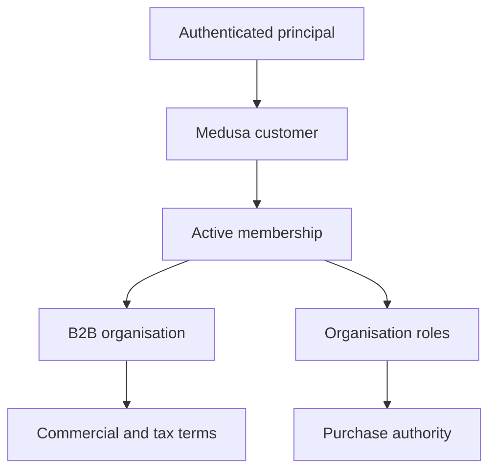
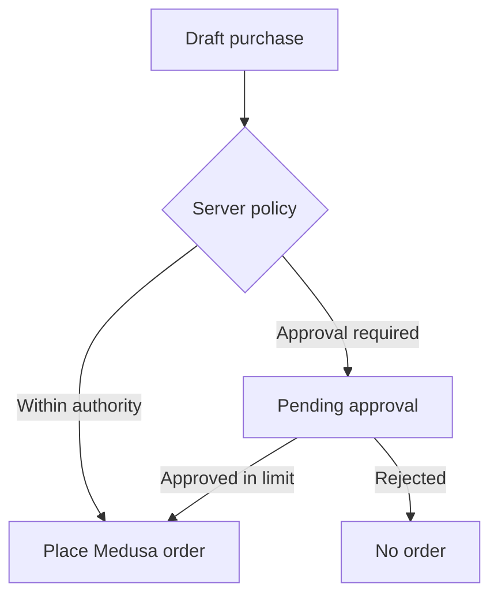

# ZuriBeans B2B Commerce

## Gate 5 outcome

ZuriBeans is an organisation-to-organisation estate. A Medusa Customer identifies a commerce
contact, but purchasing authority is established only by an active membership in an explicit B2B
organisation. A customer, B2B organisation, Baobab tenant, and seller legal entity are distinct.

Gate 5 introduces the `b2b` Medusa module and its PostgreSQL migration. It deliberately does not
seed buyers or commercial transactions; realistic organisations and buyers belong to the later
simulation-readiness gate.

## Authority chain

The server validates the active membership, organisation ID, role, spend limit, approval threshold,
and PO requirement. Email domains, hostnames, saved addresses, and previous orders are never
accepted as proof of organisation authority.

## Persistent model

| Model                      | Purpose                                                       | Isolation key                   |
| -------------------------- | ------------------------------------------------------------- | ------------------------------- |
| `B2BOrganisation`          | Buying organisation inside an authorised tenant               | `tenant_id`                     |
| `BuyerMembership`          | Customer/principal relationship with one organisation         | `organisation_id`               |
| `BuyerRole`                | Organisation-local role assignment                            | `membership_id`                 |
| `ApprovalPolicy`           | Market-aware approval threshold                               | `organisation_id`, `market_key` |
| `SpendLimit`               | Buyer ordering and approval ceilings                          | `membership_id`, `market_key`   |
| `PurchaseOrderRequirement` | Durable PO-number rule                                        | `organisation_id`, `market_key` |
| `PurchaseOrderReference`   | PO reference retained from cart through order                 | `organisation_id`               |
| `PurchaseApproval`         | Approval request and decision record                          | `organisation_id`               |
| `CommercialTerms`          | Agreement identity, validity, and Incoterm                    | `organisation_id`, `market_key` |
| `CreditTerms`              | ERP/contract credit projection, separate from buyer authority | `organisation_id`, `market_key` |
| `TaxRegistration`          | Verified jurisdictional registrations                         | `organisation_id`, `market_key` |
| `DeliverySite`             | Organisation-approved shipping and billing sites              | `organisation_id`, `market_key` |

Soft-delete-aware unique indexes protect memberships, roles, tax registrations, sites, and PO
references. Internal foreign keys prevent orphaned organisation and membership policy records.
Medusa customer, cart, and order identifiers remain engine-native references so this module does not
create forbidden cross-module database ownership.

## Roles

The initial vocabulary is `BUYER`, `SENIOR_BUYER`, `APPROVER`, `PROCUREMENT_MANAGER`,
`ACCOUNT_ADMIN`, and `VIEWER`. Roles attach to a membership. The same principal may therefore be an
approver for one organisation, a buyer for another, and unauthorised for a third.

## Purchase and approval boundary

A pending approval is not a committed order, and purchasing approval is not payment authorisation.
The `customer_po_number` is stored in a structured record, unique within the organisation, and can be
bound first to a cart and then permanently to the committed order. Canonical event payloads carry
the organisation, membership, approval, and PO references needed by the Control Plane and iDempiere.

## ERP and Control Plane boundaries

- The Control Plane remains authoritative for tenant, canonical organisation, Market, and capability
  resolution.
- Medusa owns the operational B2B membership and purchasing-policy projection.
- iDempiere remains authoritative for the Business Partner, receivables, and credit control.
- `CreditTerms.projected_credit_limit_minor` is a sourced projection; it is not reconstructed from
  Medusa order history.
- Gate 6 will bind organisation context to catalogue eligibility and negotiated pricing.

## Verification

`npm run verify:b2b-module` resolves the module and queries every repository after migrations. CI
runs it against fresh PostgreSQL and Redis services. Unit tests cover inactive memberships,
cross-organisation access, purchasing roles, mandatory PO numbers, approval thresholds, and
approver limits.
