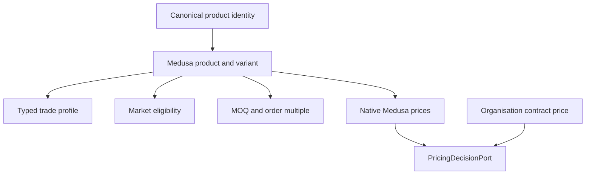
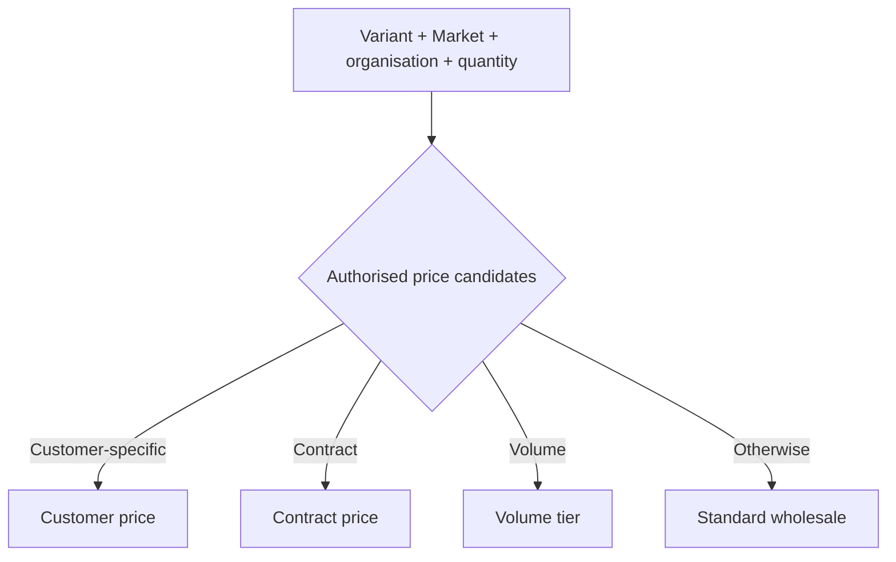

# ZuriBeans B2B Catalogue and Pricing

## Gate 6 outcome

Gate 6 provisions ten focused ZuriBeans wholesale product families through Medusa's native Product
and Pricing workflows. Each family has one physical trade-pack variant, standard UGX and ZAR prices,
two quantity tiers, explicit Market eligibility, and enforced MOQ/order-multiple data.

The bootstrap is idempotent and runs only after the Gate 4 Market bootstrap. It does not create stock
levels, organisations, buyers, contracts, orders, tax rates, or payment transactions.

## Authority model

Medusa remains operational authority for products, variants, base prices, and volume price lists.
Baobab's extension stores only concerns absent from the core model. Canonical keys and HS references
are mapping/classification references, not a claim that Medusa owns customs authority.

## Catalogue

| Product family                       |  Trade pack | HS reference |
| ------------------------------------ | ----------: | ------------ |
| Uganda Arabica Green Coffee AA       |   60 kg bag | HS-0901.11   |
| Uganda Specialty Arabica             |   60 kg bag | HS-0901.11   |
| Uganda Robusta Screen 18             |   60 kg bag | HS-0901.11   |
| Uganda Robusta FAQ                   |   60 kg bag | HS-0901.11   |
| Uganda Arabica Microlot              |   30 kg bag | HS-0901.11   |
| Uganda Bourbon Vanilla Pods Grade A  | 5 kg carton | HS-0905.10   |
| Uganda Vanilla Pods Extraction Grade | 5 kg carton | HS-0905.10   |
| Uganda Cocoa Beans                   |   60 kg bag | HS-1801.00   |
| Uganda Black Tea                     |   50 kg bag | HS-0902.40   |
| Uganda Dried Ginger                  |   25 kg bag | HS-0910.11   |

Product trade profiles also retain origin, commodity category, packaging, gross/net weight,
lot/batch controls, export-policy reference, and commodity-specific coffee, vanilla, cocoa, tea, or
ginger attributes.

## Market and quantity controls

Product publication in the shared `zuribeans_b2b` Sales Channel does not by itself establish Market
eligibility. `MarketProductEligibility` is checked using the resolved Baobab Market key and fails
closed when absent, suspended, or withdrawn. `PurchaseConstraint` separately stores MOQ and order
multiples for every variant and Market.

Gate 6 initially makes all ten families eligible in Uganda and South Africa. The records are still
independent, allowing either Market to suspend or withdraw a product without changing the other.

## Pricing precedence

The initial native Medusa price list implements:

- one to four packs: standard wholesale price;
- five to nineteen packs: volume tier;
- twenty or more packs: large-volume tier.

UGX and ZAR amounts are configured independently. No invariant derives one Market price by applying
FX to the other. Bootstrap amounts are integer commercial reference data for development and must be
reviewed through pricing governance before production use; they are not real-time commodity quotes.

`ContractPrice` is a protected organisation-scoped record. A contract amount cannot be put into a
global Medusa price list without an authorised organisation rule. The `PricingDecisionPort` gives
checkout a stable boundary: it uses native Medusa pricing today and can later delegate to a separate
Baobab Pricing Engine without changing the commerce contract.

## Verification

CI migrates a fresh PostgreSQL database, runs the Market bootstrap, executes
`npm run bootstrap:catalogue`, then verifies exactly ten products, ten trade profiles, twenty Market
eligibility records, twenty purchase constraints, and forty volume prices. Policy tests cover price
precedence, cross-organisation contract isolation, quantity tiers, MOQ/order multiples, and
fail-closed Market access.
