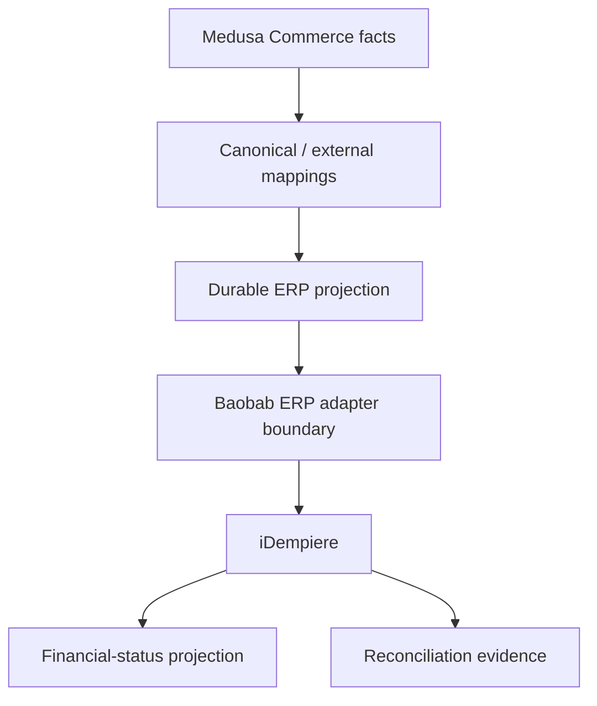

# ZuriBeans ERP integration (Gate 12)

Gate 12 creates the durable boundary between Medusa Commerce and iDempiere ERP. It never reads or writes the iDempiere database.

## Mappings

| Commerce         | ERP                   | Mapping          |
| ---------------- | --------------------- | ---------------- |
| B2B Organisation | `C_BPartner`          | Business Partner |
| Product          | `M_Product`           | Product          |
| Stock Location   | `M_Warehouse`         | Warehouse        |
| Order            | `C_Order`             | Sales Order      |
| Fulfilment       | `M_InOut`             | Shipment         |
| Payment state    | Financial consequence | Financial status |

Each record preserves canonical entity identity, Medusa-native identity, iDempiere-native identity, an external reference, source authority, and verification state. Product and Business Partner placeholders remain unverified pending authoritative Control Plane/iDempiere registration; existing Gate 7 Warehouse mappings retain ERP authority.

## Projection and outages

Order and fulfilment projections are durable and idempotent. They begin `PENDING` and may progress through publication, acknowledgement, failure, or reconciliation-required states. An ERP outage delays projection and retry; it does not mutate or roll back an accepted Commerce Order. Actual at-least-once publication and the transactional outbox arrive in Gate 13.

iDempiere financial-status projections are sequenced and reject stale/replayed messages. `OPEN`, `PARTIALLY_PAID`, `PAID`, `OVERDUE`, `CREDIT_HOLD`, and `CANCELLED` are ERP observations; they do not surrender Medusa payment or Order authority.

Reconciliation records expected and observed state plus field-level differences. Missing ERP evidence remains `PENDING_ERP`; variance is never silently synchronized.
