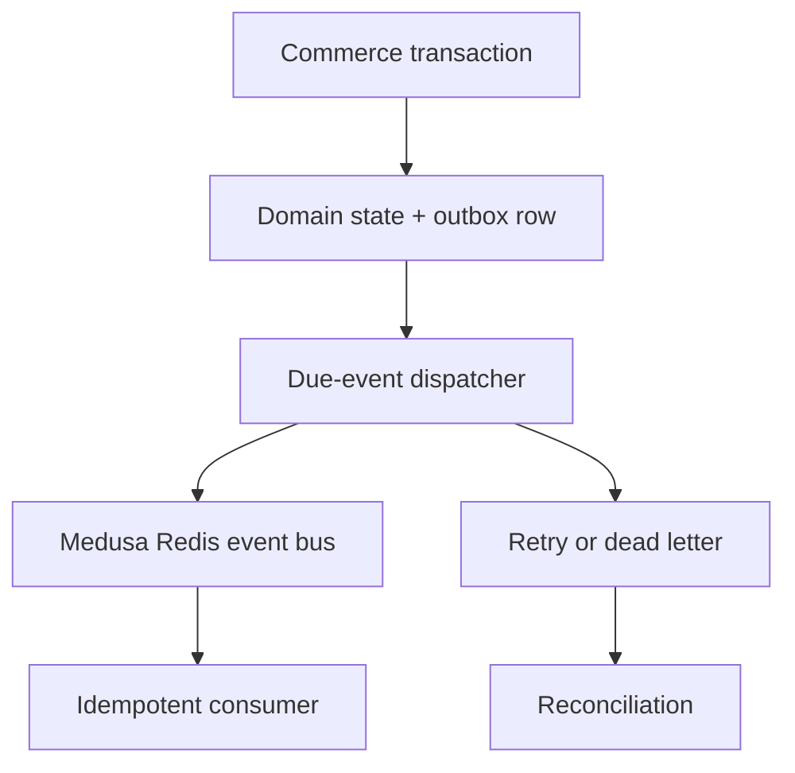

# ZuriBeans Events and Transactional Outbox

Gate 13 turns the canonical event vocabulary from earlier gates into durable delivery. A material
commerce mutation and its outbox row must be written in the same local Medusa database transaction.
No cross-engine transaction, shared database, or direct iDempiere SQL is introduced.

## Delivery contract

- Delivery is **at least once**. Publishing can succeed before the publisher records success, so a
  later attempt may legitimately redeliver the same `event_id`.
- Each durable event has a unique event ID and idempotency key. Consumers persist a receipt unique
  on `(consumer_name, event_id)` in the same local transaction as their business effect.
- The full canonical CloudEvents envelope is published, not merely `data`. Tenant scope,
  correlation, causation, W3C trace context, schema URL and canonical identity therefore survive
  the broker boundary.
- Retry uses bounded exponential backoff. Exhausted delivery becomes `DEAD_LETTER`; it is retained
  for investigation and replay rather than discarded.
- Reconciliation classifies records as matched, pending, retry-due or action-required and records
  explicit resolution evidence.

## Authority and security

Events describe commerce facts; they do not transfer Commerce Order authority from Medusa or
accounting authority from iDempiere. Payloads must contain business references and monetary values
with currency, never payment credentials, tokens, secrets, or direct database identifiers. Broker
authentication and dead-letter infrastructure remain deployment-owned configuration.

## Operational recovery

After an outage, dispatch all due `PENDING` and `RETRY` rows. Reconciliation must review dead-letter
records before replay. Replaying retains the original event ID, idempotency key, correlation and
causation. Creating a fresh identity for a replay defeats consumer deduplication and is prohibited.
