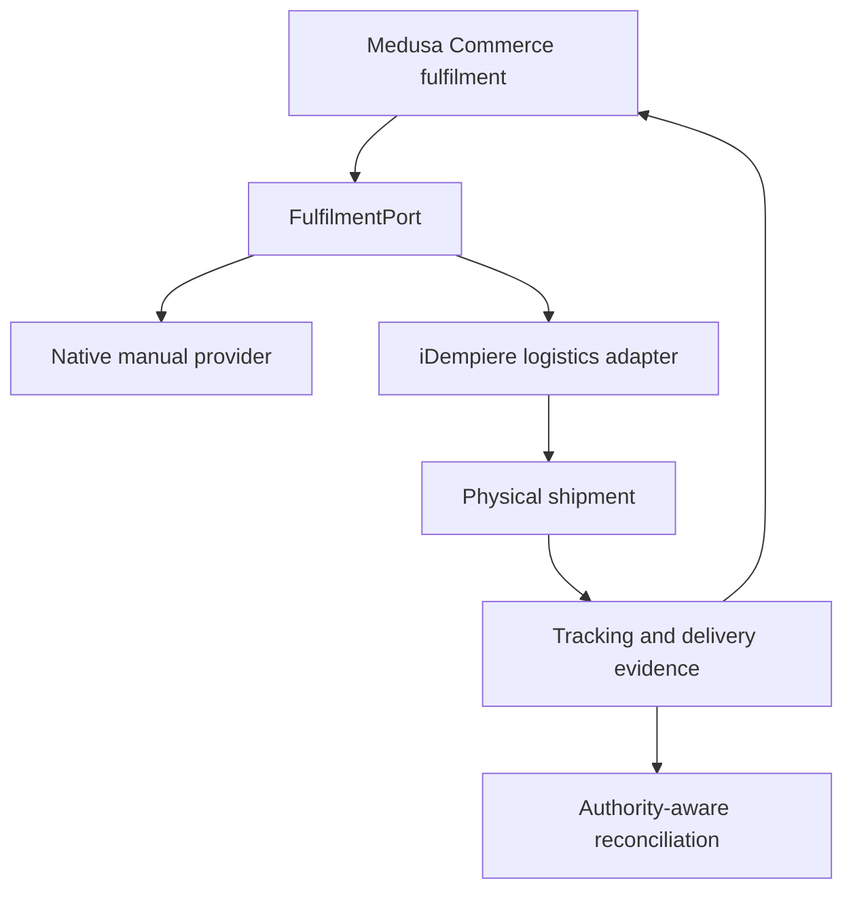

# ZuriBeans fulfilment architecture (Gate 9)

Gate 9 supports local delivery, bulk freight, customer collection, and Uganda–South Africa cross-border fulfilment. Medusa owns the customer-facing Commerce fulfilment lifecycle. The bound iDempiere, WMS, 3PL, or carrier capability owns physical allocation, pick, pack, dispatch, transport, and delivery evidence.

## Provider posture

| Mode                | Initial boundary            | Physical authority                  |
| ------------------- | --------------------------- | ----------------------------------- |
| Local delivery      | Medusa manual provider      | Bound operator/logistics capability |
| Bulk freight        | Medusa manual provider      | Bound operator/carrier              |
| Customer collection | Medusa manual provider      | Bound fulfilment location           |
| Cross-border        | iDempiere logistics adapter | iDempiere or later WMS/3PL          |

The adapter is a projection boundary, not a direct shared-database integration. Provider and carrier identifiers remain external references.

## Cross-border minimum

A cross-border request fails closed without distinct origin/destination countries, exporter and importer organisation identities, HS references, a compliance decision, an Incoterm, positive gross weight, and positive package count. Shipment, carrier, tracking, export, and customs references remain correlated metadata. Incoterms are explicit and are never inferred from a shipping option.

Dispatch requires authoritative shipment reference and dispatch time. Delivery requires authoritative delivery time. `Delivered` does not imply `Paid`, and Commerce fulfilment completion does not imply ERP financial posting.

## Persistence and reliability

The `fulfilment-bridge` module persists Market provider policies, commerce fulfilment projections, idempotent transitions, shipment/tracking evidence, and reconciliation records. Duplicate commands reuse stable idempotency keys. Missing execution records, mismatched state, and missing shipment mappings remain visible reconciliation states rather than invented success.

Transactional publication remains Gate 13 scope. Gate 9 defines canonical event vocabulary without creating a standalone Fulfilment Engine.
