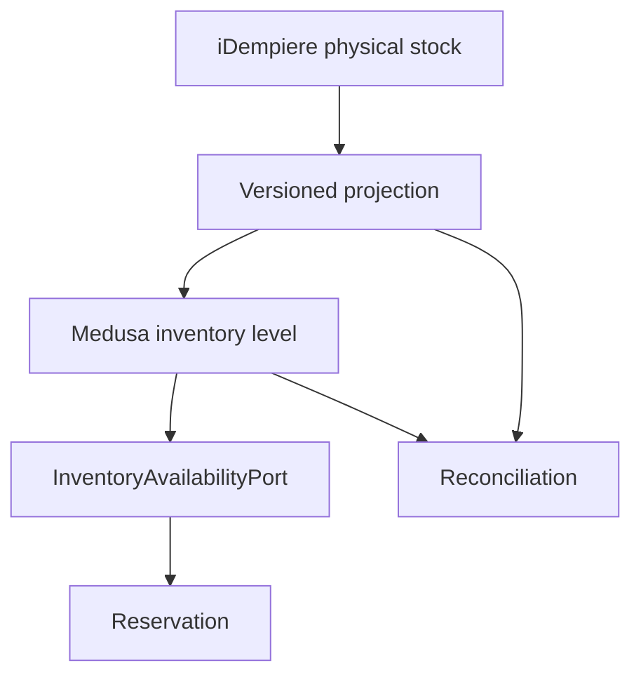

# ZuriBeans Inventory and ERP Projection

## Gate 7 outcome

Gate 7 activates Medusa Inventory for the ten ZuriBeans trade variants across six canonical
warehouse, collection, distribution, and staging locations. It introduces an inventory availability
port, replay-safe iDempiere projection records, reservation verification, and explicit reconciliation.

iDempiere remains enterprise authority for physical and accounting stock. Medusa owns the commerce
projection, reservation lifecycle, and available-to-sell value used by checkout.



## Locations

| Canonical key | Location                         | Market         | ERP reference         |
| ------------- | -------------------------------- | -------------- | --------------------- |
| `UG-KLA-01`   | Kampala Central Warehouse        | `zuribeans_ug` | `IDEMPIERE:UG-KLA-01` |
| `UG-EBB-01`   | Entebbe Export Staging           | `zuribeans_ug` | `IDEMPIERE:UG-EBB-01` |
| `UG-JIN-01`   | Jinja Collection Facility        | `zuribeans_ug` | `IDEMPIERE:UG-JIN-01` |
| `ZA-CPT-01`   | Cape Town Distribution Warehouse | `zuribeans_za` | `IDEMPIERE:ZA-CPT-01` |
| `ZA-JNB-01`   | Johannesburg Distribution Centre | `zuribeans_za` | `IDEMPIERE:ZA-JNB-01` |
| `ZA-DUR-01`   | Durban Import Staging            | `zuribeans_za` | `IDEMPIERE:ZA-DUR-01` |

The Kampala and Johannesburg entries upgrade and reuse the Gate 4 primary Stock Locations; the
other four are added by Gate 7. Every location is linked to the shared ZuriBeans B2B Sales Channel
and manual fulfilment provider. A typed `LocationMapping` keeps canonical, Medusa, and iDempiere
identities separate.

## Projection contract

Each `InventoryProjection` records:

- Medusa Inventory Item and Stock Location IDs;
- the iDempiere Warehouse reference;
- a monotonically increasing source sequence;
- a unique idempotency key;
- on-hand, incoming, and unavailable quantities;
- projection and application timestamps.

Stale or replayed source sequences fail closed. The initial bootstrap uses clearly labelled synthetic
Gate 7 projection data so inventory behaviour can be exercised before the Gate 18 simulation. It is
not an accounting opening balance and must never be exported back to iDempiere as authority.

## Availability and reservations

`InventoryAvailabilityPort` exposes availability, reserve, and release operations. Its initial adapter
uses Medusa Inventory directly with backorders disabled and correlation metadata retained. The port
allows a future dedicated Inventory Engine without changing checkout's contract.

Available-to-sell is never negative:

```text
ATS = max(0, Medusa stocked quantity - Medusa reserved quantity)
```

Incoming stock is observable but not silently treated as available. Reservation creation and release
are verified against a fresh database and the test reservation is removed before CI completes.

## Reconciliation

Reconciliation compares the ERP projection with the applied Medusa state; it does not make the two
databases one authority.

| Condition                                | Result     |
| ---------------------------------------- | ---------- |
| Medusa stocked equals ERP on-hand        | `MATCHED`  |
| Quantities differ                        | `VARIANCE` |
| An operator resolves a recorded variance | `RESOLVED` |

Every reconciliation retains ERP on-hand, Medusa stocked, Medusa reserved, delta, observation time,
and optional resolution evidence. Variance is surfaced rather than silently overwritten.

## Verification

After the Market and catalogue bootstraps, CI runs `npm run bootstrap:inventory` and
`npm run verify:inventory`. The verifier requires six mappings, ten inventory items, sixty inventory
levels, sixty ERP projections, sixty matched reconciliations, and a working reserve/release cycle.
No order, payment, shipment, or accounting transaction is created.
