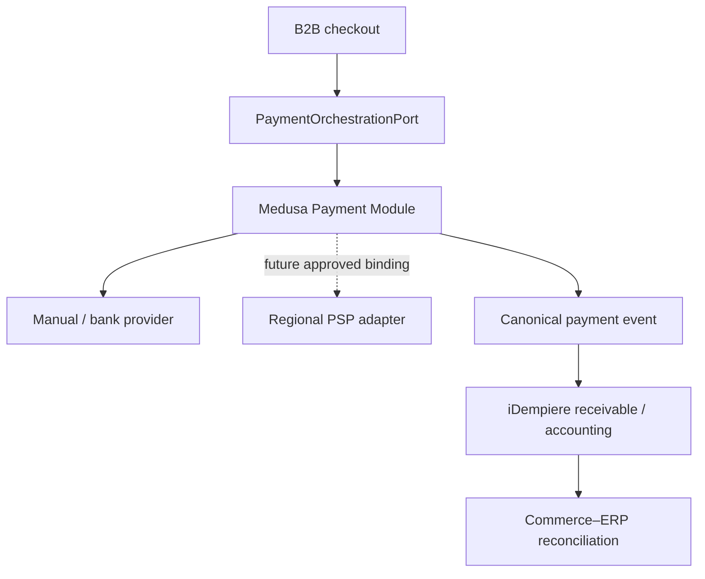

# ZuriBeans payment architecture (Gate 8)

Gate 8 introduces a bounded payment capability for ZuriBeans in Uganda and South Africa. Medusa remains the commerce payment orchestrator, a payment provider remains authoritative for provider-side execution, and iDempiere remains authoritative for receivables, settlement accounting, and financial posting.

## Authority and flow

An invoice-terms order is `PENDING` while iDempiere establishes and settles its receivable. It is never represented as captured merely because the buyer has approved terms.

## Initial policies

| Market                 | Currency | Active methods                                  | Regional abstraction                                            |
| ---------------------- | -------- | ----------------------------------------------- | --------------------------------------------------------------- |
| ZuriBeans Uganda       | UGX      | Bank transfer, manual settlement, invoice terms | MTN MoMo Uganda, disabled pending merchant approval             |
| ZuriBeans South Africa | ZAR      | Bank transfer, manual settlement, invoice terms | Peach Payments South Africa, disabled pending merchant approval |

Both Markets allow `PREPAID`, `DUE_ON_RECEIPT`, `NET_7`, `NET_14`, and `NET_30`; actual organisation eligibility remains governed by the B2B credit-terms projection rather than prior usage.

## Persistence

The `payment-bridge` module stores Market policy bindings, commerce payment projections, idempotent status transitions, and Commerce-to-ERP reconciliation evidence. It does not store banking credentials, card data, ERP ledger entries, or accounts-receivable balances.

Ambiguous provider outcomes use `UNKNOWN`, not `FAILED`. Retrying a command reuses the original idempotency key. Invalid lifecycle jumps are rejected. Provider state and references remain available for reconciliation rather than being erased by canonical status mapping.

## Deferred work

- Live regional PSP enablement requires a separate credential, merchant-account, webhook-security, and compliance decision.
- Refunds, disputes, chargebacks, and settlement batches remain later payment increments.
- Transactional event publication belongs to Gate 13; Gate 8 only defines the canonical event vocabulary.
- No standalone Payments Engine is created.
