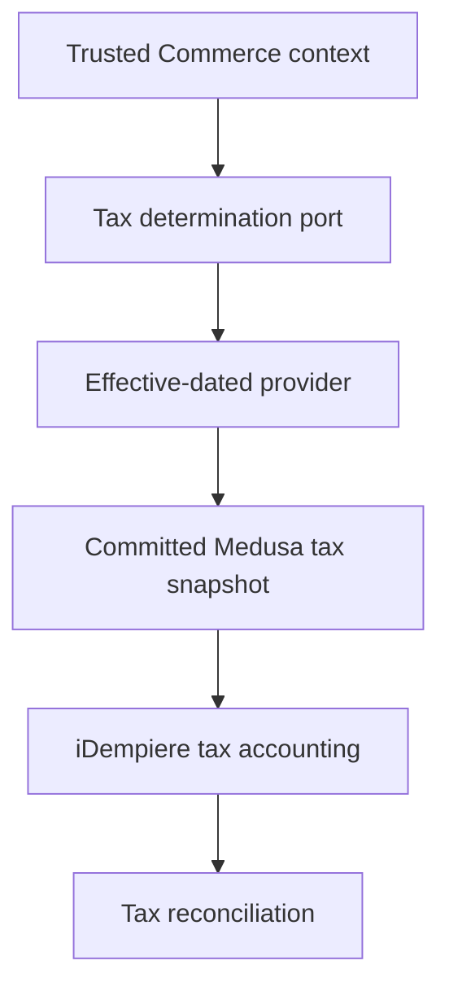

# ZuriBeans tax architecture (Gate 10)

Gate 10 introduces contextual tax projections for ZuriBeans Uganda and South Africa. Medusa remains authoritative for tax committed to a Commerce transaction; iDempiere remains authoritative for tax accounting, liabilities, statutory documents, and financial posting.

## Context and policy

Uganda/UGX and South Africa/ZAR each have a separate Market, jurisdiction, Legal Seller, seller-registration reference, and Medusa system-provider binding. These concepts are never inferred from one another. Both contexts fail closed when authoritative tax cannot be determined and use tax-exclusive B2B pricing.

The bootstrap deliberately contains no statutory rates. Rates enter Trade only as effective-dated, versioned projections from an approved authority. Gate 10's executable verification uses a plainly labelled synthetic rule; it is not Uganda or South Africa tax advice or production configuration.

## B2B profiles

Organisation-scoped profiles preserve registration reference, verification state and expiry, verification source, eligible treatments, exemption reason, and provenance. Organisation membership alone grants no treatment. `ZERO_RATED`, `EXEMPT`, and `REVERSE_CHARGE` remain distinct and require a legal reason rather than an unexplained zero.

## Historical integrity and provenance

A determination records the taxable basis, tax amount, deterministic rounding result, currency, jurisdiction, classification, transaction type, treatment, effective time, rule reference/version, provider and calculation references, source authority, retrieval time, Legal Seller, and correlation/idempotency keys. Future rules do not rewrite historical determinations.

Commerce-to-ERP differences enter explicit reconciliation; ERP never silently replaces the customer tax committed by Commerce. Statutory rates, invoices, reporting and transactional outbox publication remain outside this gate.
