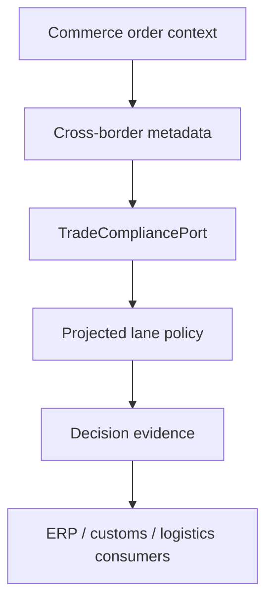

# ZuriBeans trade readiness (Gate 11)

Gate 11 makes cross-border Commerce records ready for downstream customs and logistics processes without turning Medusa into a compliance engine.

Each transaction preserves Legal Seller, exporter/importer, origin/destination, Incoterm, procedure and registration references, and correlation/idempotency identity. Lines preserve canonical Product reference, HS classification reference, country/region of origin, trade UOM, quantity, weights, and optional lot reference.

The initial UG–ZA and ZA–UG lane policies are explicitly configuration evidence, not customs authority. The port returns `APPROVED`, `REVIEW_REQUIRED`, or `REJECTED`; absent or ambiguous effective policy fails closed. Unsupported Incoterms or trade UOMs require review.

HS references remain classifications, not Product identity. Incoterms are not inferred from shipping methods. Trade UOM remains distinct from Medusa sales quantity. Provider decisions and customs identifiers are external references. A future dedicated compliance engine can replace the projected adapter without changing Commerce contracts.
